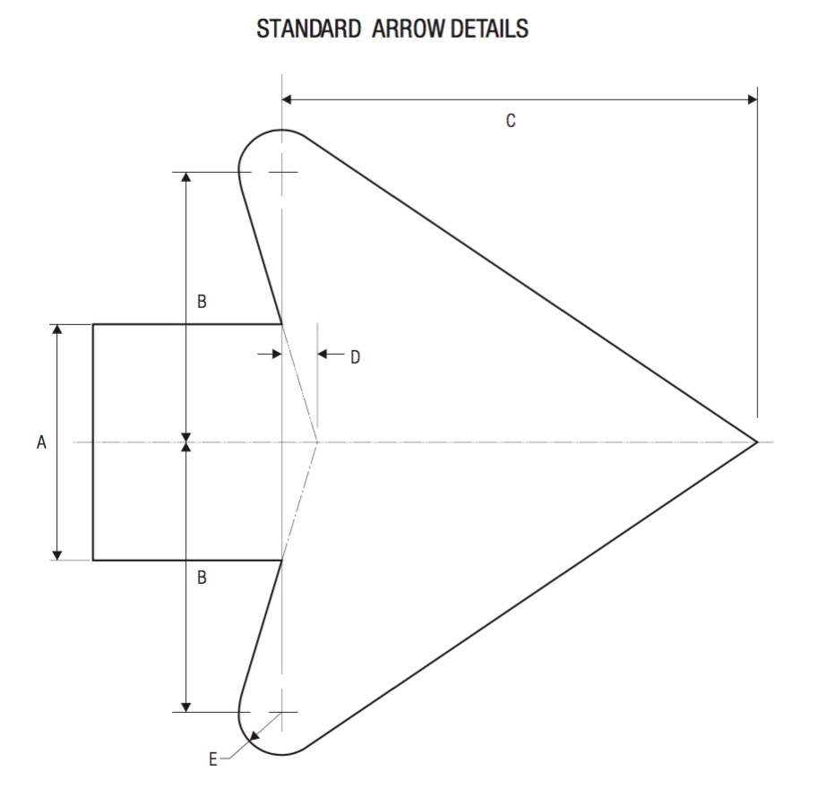

## Design Guidelines

The icons in this project follow closely the design guidelines established in the
[MUTCD Standard Highway Signs guide](http://mutcd.fhwa.dot.gov/ser-shs_millennium.htm),
2009 edition published by the US Federal Highway Administration.

The MUTCD is [in the public domain](http://mutcd.fhwa.dot.gov/knowledge/faqs/faq_general.htm#printq5)
and as such it is not copyrighted.

Each icon should be

* 25px x 25px
* SVG
* Single color fill
* Path outline only, no stroke
* Pixel grid aligned (where possible)

### Arrows

Arrows use the "Standard Arrow" described in MUTCD Standard Highway Signs
[Appendix](http://mutcd.fhwa.dot.gov/ser-shs_millennium.htm).

An upward facing Standard Arrow is included in this icon pack, and forms the basis of all turn
lane arrows.

Arrowhead rotation angles are chosen based on the turn lane indication:

<table>
<tr>
    <th>Through</th>
    <th>Slight Left</th>
    <th>Left</th>
    <th>Sharp Left</th>
    <th>Reverse Left</th>
</tr>
<tr>
    <td>no rotation 
        
    </td>
    <td>45 degrees 
        
    </td>
    <td>70 or 90 degrees 
        
    </td>
    <td>135 degrees 
        
    </td>
    <td>180 degrees 
        
    </td>
</tr>
</table>

As the number of arrows increases, the arrows scale down:

<table>
<tr>
    <th>1 Arrow</th>
    <th>2 Arrows</th>
    <th>3 Arrows</th>
    <th>4 Arrows</th>
</tr>
<tr>
    <td>
        <ul><li>3px stroke</li><li>standard arrowhead</li></ul>
        
    </td>
    <td>
        <ul><li>2.5px stroke</li><li>83% scaled arrowhead</li></ul>
        
    </td>
    <td>
        <ul><li>2.25px stroke</li><li>75% scaled arrowhead</li></ul>
        
    </td>
    <td>
        <ul><li>2px stroke</li><li>66% scaled arrowhead</li></ul>
        
    </td>
</tr>
</table>

Other important rules for arrows:
* Bottom aligned with each other, 2px from icon bottom edge
* Left-right centered
* Smooth curves, no kinks
* Arrow shaft path connects to the arrowhead anchor point

### Other Icons

Other non-arrow icons (bus, hov, pedestrian, tram, etc) also imitiate the icons found
in the MUTCD Standard Highway Signs [Appendix](http://mutcd.fhwa.dot.gov/ser-shs_millennium.htm).
